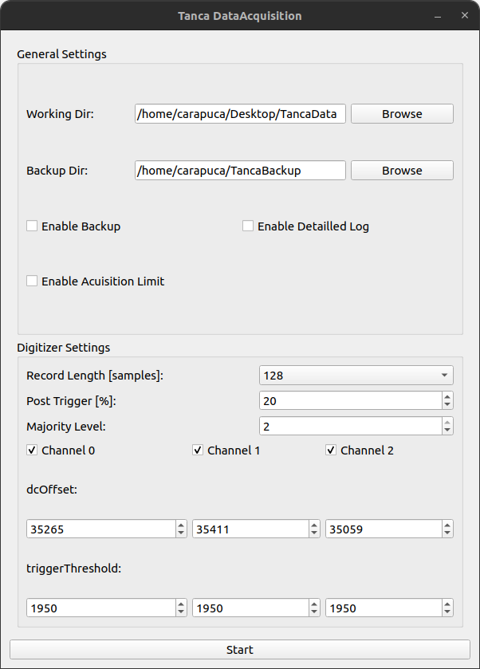
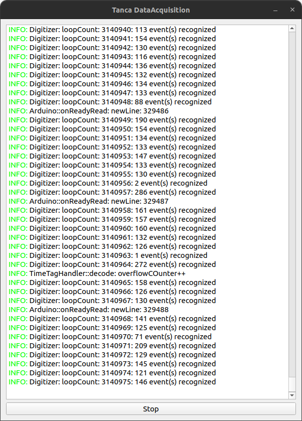
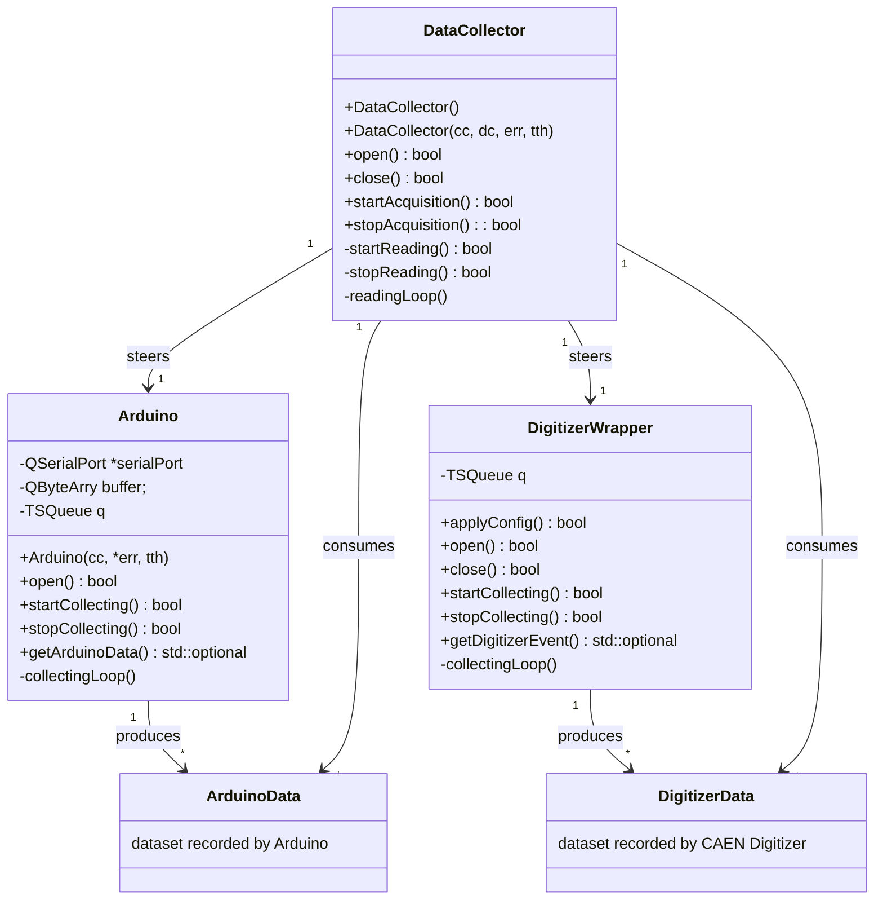
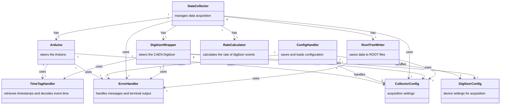

# TancaDataAcquisition (C++)

C++ software for real-time data acquisition with a CAEN DT5720B digitizer and Arduino Uno, measuring muon radiation and environmental conditions

## Description

This software was developed during a project internship at the Universidade Estadual de Campinas in the lab of Professor Anderson Fauth.
It is designed for data acquisition in the Tanca Project, an experimental setup to detect cosmic muon radiation.

## The software

- Collects and stores signals from three photomultiplier tubes (PMTs) connected to a CAEN DT5720B digitizer.

- Integrates readings from environmental sensors (pressure and temperature) connected to an Arduino Uno.

- Uses a Producer-Consumer architecture to handle concurrent data acquisition and storage efficiently.

- Stores the collected data in ROOT file format.

## Technologies

- C++ (multithreading, Producer-Consumer pattern)

- Qt6 (GUI)

- CAEN Digitizer Library

- Arduino Uno (serial communication)

- Linux environment

## Key Features

- Real-time acquisition of PMT and sensor data

- Thread-safe data handling

- Modular design for extensibility

## Usage

- Tested on Ubuntu 22.04 LTS

- Install the necessary libraries from the CAEN website:

    - `CAENDigitizer`: tested version `2.18.0`

    - `CAENComm`: tested version `1.7.0`

    - `CAENVMELib`: tested version `4.0.2`

    - `CAENUSBdrvB`: tested version `1.6.1`

- These libraries are linked to each other and must be installed in this order.

- Ensure the CAEN digitizer, Arduino, and all sensors are properly connected.

- Clone the Git repository and compile the program.

- Sensor and acquisition settings can be adjusted via the GUI.

- Data acquisition can be started and stopped from the GUI.

  
  

## Class Diagram

The following diagram illustrates the Producer-Consumer relationship:

The following class diagram shows the ownership and relations:

- `uses` pointer relation
- `has` ownership
- `handles` load/save configuration

